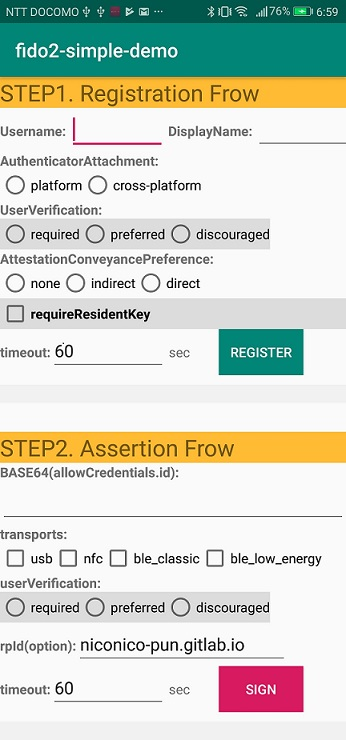

# FIDO2 SIMPLE DEMO for Android native




This project uses `com.google.android.gms:play-services-fido`'s [Fido2ApiClient][1] to register a credential and also
sign a challenge.

It demonstrates the Fido2 Api with settable values.

It also does not validate any of the responses, as that would be done server side.

This project only proceed client validation flows.

Just run the app and select some params and tap the `Register` button.
It will display the results on the app and in the log details like below.

(The output result may be different by selected option params.)
```
b64KeyHandle: 8yQWAoiY1Zn/KMbAvoCfISZVD+ZVwzQDld3+cWd6+5wWcQGVAmtaHr6ov2gupcgZzdCCCp3gK1tF
    eA4d3alldw==
clientDataJson: {"type":"webauthn.create","challenge":"eUiPNPvuL52y9fF51xf49Q","origin":"android:apk-key-hash:qz7fNlJErX_Gi-GXFgi60o7uP_ByiGFuP_OouU-M8Hc","androidPackageName":"com.nicopun.fido2_simple_demo"}
attestationObject:
    	aaguid: AAAAAAAAAAAAAAAAAAAAAA==
    
    	rpIdHash: gXhtPA1ej6UEz4z7FduuIKVHlscvHMg+fVOkqYLgyQA=
    
    	UV: false
    	UP: true
    	attStmt: { sig: co.nstant.in.cbor.model.ByteString@e951557e, x5c: [co.nstant.in.cbor.model.ByteString@eeb88fa7] }
    	count: 0
    	ED: false
    	AT: true
    	credentialId: 8yQWAoiY1Zn/KMbAvoCfISZVD+ZVwzQDld3+cWd6+5wWcQGVAmtaHr6ov2gupcgZzdCCCp3gK1tF
    eA4d3alldw==
    
    	fmt: fido-u2f
```

Then you can tap the `Sign` button, and the Fido2 api will be used to sign a challenge with the key that was just
generated
The output result is like below.
```
clientDataJson: {"type":"webauthn.get","challenge":"26ELLPg7jov68x5kxDSarw","origin":"android:apk-key-hash:qz7fNlJErX_Gi-GXFgi60o7uP_ByiGFuP_OouU-M8Hc","androidPackageName":"com.nicopun.fido2_simple_demo"}
b64Signature: MEYCIQCuE8urMJx8Pwnin01TWTd6zuZ5ecOh/FqfaXqtFg3ROAIhALhfstMuwpqlgk4EQ3+YQOEf
    ftKB0RzL9HQgBGq4CN0k
    b64UserHandle: 
    b64authData: gXhtPA1ej6UEz4z7FduuIKVHlscvHMg+fVOkqYLgyQABAAAAiw==
    authData:
    	count: 139
    	rpIdHash: gXhtPA1ej6UEz4z7FduuIKVHlscvHMg+fVOkqYLgyQA=
    
    	UV: false
    	UP: true
    	ED: false
    	AT: false
```


As long as you do not change the Relying Party ID (in [PublicKeyCredentialRpEntity][2]), the signing key or the package
name, the app should just work

You can easily confirm api behavior by option params.

## Relying Party ID

Details about rpId is described on [jedrivisser/fido2-android-api-demo][0], so please refer to that.

For this sample app I have set the RP ID to `niconico-pun.gitlab.io` and I am hosting this `assetlinks.json`:

```json
[
  {
    "relation": ["delegate_permission/common.handle_all_urls"],
    "target": {
      "namespace": "android_app",
      "package_name": "com.nicopun.fido2_simple_demo",
      "sha256_cert_fingerprints": [
        "AB:3E:DF:36:52:44:AD:7F:C6:8B:E1:97:16:08:BA:D2:8E:EE:3F:F0:72:88:61:6E:3F:F3:A8:B9:4F:8C:F0:77"
      ]
    }
  }
]
```

on <https://niconico-pun.gitlab.io/.well-known/assetlinks.json> where:


## Hosting assetlinks.json

If you want to host your own assetlinks.json for a test, you need to set **RPID** at [HERE][3].

In addition, you neet to host assetlinks.json.
I am using gitlab pages, it is easy and no cost.

## References
This project is inspired by [jedrivisser/fido2-android-api-demo][0].

[0]: https://github.com/jedrivisser/fido2-android-api-demo
[1]: https://developers.google.com/android/reference/com/google/android/gms/fido/fido2/Fido2ApiClient
[2]: https://developers.google.com/android/reference/com/google/android/gms/fido/fido2/api/common/PublicKeyCredentialRpEntity
[3]: https://gitlab.com/niconico-pun/fido2simpledemo/blob/f32f5c21c3fa3ea823e35bf68bd022d429fd403d/app/src/main/java/com/nicopun/fido2_simple_demo/MainActivity.java#L63

